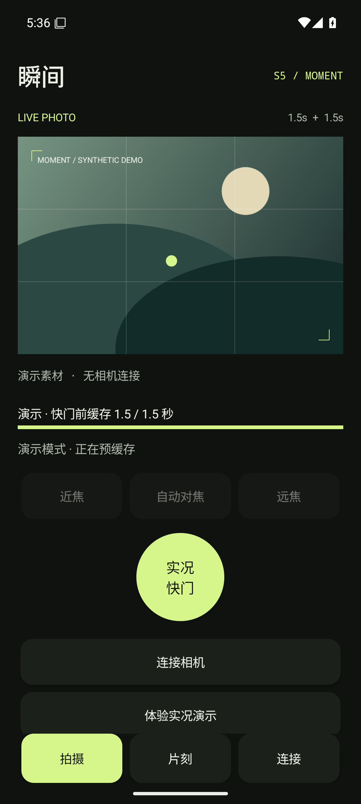
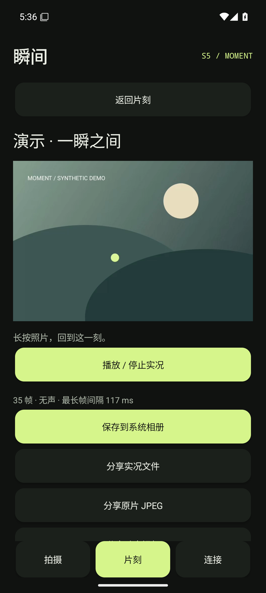

# 瞬间 S5 / Moment

为 **OPPO Find X8 + 初代 Panasonic LUMIX S5** 开发的原生 Android 实况照片应用。USB-C 数据线直连，不需要视频采集卡、不依赖云端、不刷机。

Experimental Android Motion Photo companion for the original Panasonic LUMIX S5 over USB. Unofficial, MIT-licensed. **Physical S5 / Find X8 compatibility is not yet verified.**

[下载 v0.1.0 预览版 APK](https://github.com/USER-HFC/moment-s5/releases/tag/v0.1.0) · [MIT 许可证](LICENSE) · [测试范围](TEST_REPORT.md)

 

## 当前交付

- 原生 Android APK，最低 Android 13（API 33）。
- Panasonic PTP USB 会话、实时 JPEG 取景、AF、近/远焦步进、曝光参数读取。
- App 快门触发 S5 拍照，手机缓存快门前后约各 1.5 秒取景，再接收本次原尺寸 JPEG。
- 原照片 + H.264 视频打包为 Android Motion Photo；保留原始 EXIF 与 JPEG 数据。
- 可选手机麦克风收音，AAC 音轨与视频合并。默认关闭，需要明确授予录音权限。
- 本地片刻列表、长按播放、独立播放按钮、系统相册导出、分享原片/视频/实况文件。
- 可运行的合成演示，用于无相机测试。演示拍摄、界面及元数据都明确标记，不伪装成机身输出。
- 连接诊断可分享，不记录机身序列号，不上传日志。

**状态：应用构建、Android 模拟器媒体链路及本地验证可执行；尚未在真实 S5/Find X8 上验证 USB 会话、镜头控制、取景连续性和 ColorOS 相册识别。** 本仓库没有 iPhone 原生客户端；Android Motion Photo 不能直接当作 Apple Live Photo。

详细验证范围与结果见 [TEST_REPORT.md](TEST_REPORT.md)，交互与视觉取舍见 [DESIGN.md](DESIGN.md)。

## 在 OPPO 上使用

1. 从 [Releases](https://github.com/USER-HFC/moment-s5/releases) 下载并安装 `MomentS5-0.1.0-debug.apk`。这是开发测试签名，不是商店发行包。
2. 手机设置搜索“OTG”并开启。使用支持数据的 USB-C to USB-C 线接 S5。
3. S5 选择 **PC(Tether)**、单张拍摄、JPEG 或 RAW+JPEG，确认 SD 卡可写。先用较短快门测试，例如 1/125s。
4. App 点“连接相机”，允许 USB 访问，等取景和 1.5 秒缓存就绪。
5. 用 **App 的实况快门**拍摄。在接收这张照片期间不要同时按机身快门或连接其他遥控软件。
6. 到“片刻”长按照片回放，也可以点“播放 / 停止实况”。“保存到系统相册”写入 `DCIM/MomentS5`。
7. 如需声音，在“连接”页开启“录制手机环境声”。离开 App 后停止收音和连接；回来手动重连。

没有相机时，在“拍摄”页点“体验实况演示”。它真实执行缓存、编码和导出，但使用程序生成的风景和移动光点。

## 重要的能力边界

- **照片**来自 S5 本次 JPEG；RAW 留给机身保存，本版不下载或处理 RW2。程序不会主动删除相机中的文件。
- **动态**来自 USB 取景，最长边限制 960 像素、输出 15 fps。重复帧按真实时间显示，不表示机身提供了 15 个不同画面/秒。不是机内 4K 视频，也不是通过缓存补拍过去的 RAW。
- 快门时刻以 USB 指令发出时间近似，不是硬件曝光起始时间。照片与动态的精确同步要在真机上校准。
- 拍照可能暂停取景。本版测量并显示最长帧间隔；若没有快门后画面，会标记并用上一帧保持剩余时间，而不会把不连续说成连续。
- 音频来自手机，与 USB 画面共享单调时钟，但实际取景传输延迟仍需校准。收音失败会在日志中记录；缓存不足时导出无声版本。
- 以横向拍摄作为首次真机测试条件。竖拍静态 EXIF 原样保留，但机身取景方向与动态匹配尚未真机验证。
- “系统相册识别为实况”取决于 ColorOS 版本；App 内回放不依赖系统相册识别。社交软件可能只保留 JPEG，需要分别验证分享渠道。
- App 退到后台会关闭连接，不提供后台持续预录。合成期间请等当前照片完成；已下载的原片即使合成失败也会保留。
- 只支持一个进行中的实况任务；原片接收上限 64 MB，压缩 JPEG 环形缓存上限 32 MB。
- 近/远焦为镜头相对步进，非精确距离控制。A/B 可重复拉焦未实现，不能用近/远按钮冒充精确跟焦。

## 构建

环境：JDK 17、Android SDK Platform 35、Build Tools 34.0.0、Gradle 8.9 / Android Gradle Plugin 8.7.3。应用本身无第三方运行时依赖。

安装 JDK 17 并配置 Android SDK（Android Studio 可代为安装），设置 `ANDROID_HOME` 或在不提交的 `local.properties` 中配置 `sdk.dir`。Windows 可执行：

```powershell
.\gradlew.bat :app:assembleDebug :app:lintDebug
.\tools\check-core.ps1
```

新机器可运行 `tools/bootstrap.ps1` 下载所需 Android 命令行工具。脚本只使用自己的工具目录，不改系统 PATH 或 JAVA_HOME；JDK 17 需已安装。完成后按输出指令接受 Android SDK 许可并构建。

### 设备媒体检查

```powershell
.\gradlew.bat :app:assembleDebug :app:assembleDebugAndroidTest
adb -s emulator-5554 install -r app/build/outputs/apk/debug/app-debug.apk
adb -s emulator-5554 install -r app/build/outputs/apk/androidTest/debug/app-debug-androidTest.apk
adb -s emulator-5554 shell am instrument -w cn.moment.s5.test/cn.moment.s5.DeviceChecks
```

检查会创建明确标记的演示照片并导出一份到模拟器相册，覆盖完整 CaptureEngine、原片尺寸、AVC 样本时间、视频解码、XMP 视频长度、AAC 合并与相册字节一致性。它不测试真实 USB。

`tools/ui-smoke.ps1` 只允许模拟器，执行连接错误提示、演示快门、片刻列表、回放和截图，再采集横屏、小屏及大字体截图；会在结束时恢复模拟器显示设置。

## 代码定位

| 文件 | 职责 |
| --- | --- |
| `UsbS5.java` / `Ptp.java` | USB 端点、PTP 容器、S5 指令、拍摄事件、原片接收 |
| `CaptureEngine.java` / `FrameRing.java` | 单任务拍摄、前后缓存、错误保留、帧间隔测量 |
| `VideoEncoder.java` | JPEG 时间序列转 H.264，实际时间上的缺帧保持 |
| `AudioRing.java` / `AudioMux.java` | 可选 PCM 缓存、AAC 编码与复用 |
| `MotionPhoto.java` / `MomentStore.java` | 标准格式、本地存储、MediaStore 导出 |
| `MainActivity.java` / `PreviewView.java` / `HoldPhotoView.java` | 原生相机界面与回放 |
| `ShareProvider.java` | 限定输出路径的只读分享 |

每次成功拍摄包含 `original.jpg`、`motion.mp4`、`MOMENT_MP.jpg`、`moment.json`。静态原片与视频可独立分享，也保留后续转换到 Apple Live Photo 的素材基础；本版未提供该转换器。

## 开源来源

项目代码使用 [MIT 许可证](LICENSE)。第三方组件保留各自许可证；Gradle Wrapper 使用 Apache-2.0，见 [NOTICE.md](NOTICE.md)。本项目与 Panasonic / OPPO 没有官方关联。

相机协议适配自 MIT 许可的 [baku89/tethr](https://github.com/baku89/tethr)，固定参考提交和完整许可见 [NOTICE.md](NOTICE.md)。没有打包松下固件或闭源 SDK DLL。

Motion Photo 容器按照 [Android 官方格式](https://developer.android.com/media/platform/motion-photo-format)实现。USB 访问使用 [Android UsbManager](https://developer.android.com/develop/connectivity/usb/host)。
