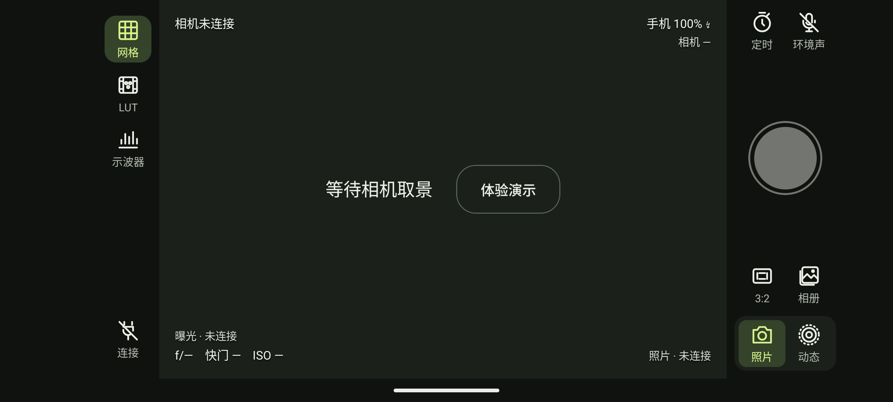

# 瞬间 Lumix / Moment

为 Panasonic LUMIX 系列相机打造的 React Native 实况照片应用。当前优先适配初代 S5 + OPPO Find X8；USB-C 数据线直连，不需要视频采集卡、不依赖云端、不刷机，后续可扩展其他机型。

Experimental Android Motion Photo companion for the original Panasonic LUMIX S5 over USB. Unofficial, MIT-licensed. **Physical S5 / Find X8 compatibility is not yet verified.**

[预发布 v0.8.0-beta.3](https://github.com/USER-HFC/moment-s5/releases/tag/v0.8.0-beta.3) · [最新稳定版 v0.7.0](https://github.com/USER-HFC/moment-s5/releases/tag/v0.7.0) · [MIT 许可证](LICENSE) · [测试范围](TEST_REPORT.md)

**v0.8.0-beta.3（code 24）是预发布版。v0.7.0 仍是最新稳定版。** 日常使用请安装 [v0.7.0](https://github.com/USER-HFC/moment-s5/releases/tag/v0.7.0)；想试用本版协议修复时再下载 [v0.8.0-beta.3 arm64 APK](https://github.com/USER-HFC/moment-s5/releases/tag/v0.8.0-beta.3)。

本版继续提供两种拍摄：普通照片下载这一次的 JPEG，动态照片在约 3 秒取景缓存就绪后保存 Motion Photo。透明示波器和 LUT 仍然可用。USB 是默认和推荐的连接方式。Wi-Fi 仍是实验功能，界面标明「未经真机验证」。

USB 与实验 Wi-Fi 的协议修复概括如下，完整清单在 [PROTOCOL_FIXES.md](PROTOCOL_FIXES.md)：

- USB 在收到回复的第一个字节之前会一直等到期限，快门期限为 60 秒；传输中途超时仍然断开。ISO 和光圈优先读当前参数，快门可以显示 B 门、整秒和分数快门。
- 实验 Wi-Fi 按公开的 LUMIX Sync 顺序等待机身确认、订阅事件后再取景，并以较疏的保活和有限的目录读取减少整卡遍历。原片允许 512 字节填充。快门仍然只发一次。

独立的自动对焦按钮已移除。USB 和演示有取景时，点按画面中央的对焦框即可自动对焦；Wi-Fi 只有在机身声明支持自动对焦时才显示这个框。远焦 / 近焦按钮只在 USB 连接时显示，每次按一下走一档相对步进；方向尚未在真机上确认。

**尚未在真实 S5 / Find X8 上验证。** 协议修复只用自写的假设备测过。模拟器上的 DEMO 和连接面板见 [v0.8.0-beta.3 截图记录](evidence/v0.8.0-beta.3/REPORT.md)。beta.2 可直接覆盖安装本版；从 v0.7.0 升级须先把照片导出到系统相册并确认，再卸载 v0.7.0，因为签名不同。



## 当前交付

- React Native Android APK，最低 Android 13（API 33），只提供 `arm64-v8a`。支持竖屏和双向横屏，工具栏、取景和快门区随方向重排。`mobile/` 是 RN 工程，产品名为「瞬间 Lumix」。启动后直接进入拍摄页。
- 连接面板默认是 USB。同一面板提供「Wi-Fi（实验）」和合成演示。演示画面与元数据标为 DEMO / SYNTHETIC DEMO。
- **照片**：下载本次 JPEG，可选 LUT，写入 App 相册，并可导出到 `DCIM/MomentS5`。无三秒预缓存，不生成视频。机身 SD 卡原片保持不动。
- **动态**：手机保留快门前约 3 秒取景。缓存就绪后，快门冻结这段队列并触发机身拍摄，再接收本次 JPEG，打包为 Android Motion Photo。视频里只有快门前的取景帧。
- 监看有实时取景和构图网格。LUT 同时作用于监看和手机端渲染；`original.jpg` 永远是相机原始 JPEG，`rendered.jpg` 才是派生文件。可导入 LUMIX Lab 的 33-grid `.cube` 或包含它的 `.zip`。内置 8 个只读 Fuji 风格近似预设，说明见 [NOTICE.md](NOTICE.md)。LUT 必须和输入色彩空间匹配，App 不会把普通 JPEG 自动变成 V-Log。
- 透明示波器可同时打开 RGB 直方图、亮度波形、RGB 分列和矢量示波器，各自移动、放大、缩小和关闭。
- 对焦：没有单独的自动对焦按钮。USB 和演示在取景上显示中央对焦框，点按即自动对焦；Wi-Fi 要等机身声明支持才显示这个框。远焦 / 近焦只在 USB 已连接、且不是演示时出现。它们是相对步进，方向尚未在真机上确认，也没有 A/B 精确拉焦。
- 相册从拍摄页进入，返回拍摄页。最近照片可双指缩放、单击显隐操作；动态照片可长按回放，普通照片不显示 LIVE。列表可切换旧照片。删除只移除 App 内副本。
- 可选手机麦克风，默认关闭，授权后才把 AAC 音轨并入动态照片。
- 连接诊断可以分享。记录里不包含机身序列号，日志不上传。

**状态：当前 release 能在 Android 模拟器里启动并完成上述 DEMO 界面。尚未在真实 S5 / Find X8 上验证 USB 会话、Wi-Fi 握手、镜头步进方向、取景连续性或 ColorOS 相册识别。** iOS 页面工程已由 RN 生成，ImageCaptureCore / PTP 原生桥还没接入，不能把 iPhone / iPad 当成已支持。Android Motion Photo 也不能直接当作 Apple Live Photo。驱动仍限定初代 S5。

交互取舍见 [DESIGN.md](DESIGN.md)，更早的测试范围见 [TEST_REPORT.md](TEST_REPORT.md)。

## 在 OPPO 上使用

1. 稳定使用请下载 [v0.7.0](https://github.com/USER-HFC/moment-s5/releases/tag/v0.7.0)。试用协议修复请下载 [v0.8.0-beta.3 预发布 arm64 APK](https://github.com/USER-HFC/moment-s5/releases/tag/v0.8.0-beta.3)。从 beta.2 可以直接覆盖安装。从 v0.7.0 升级时，先把照片保存到系统相册并打开确认，再卸载 v0.7.0；卸载会清掉 App 内照片和导入的 LUT，SD 卡原片和已经导出的副本还在。
2. 手机设置里打开 OTG。用能传数据的 USB-C 线连接 S5。这是推荐方式。
3. S5 选择 **PC(Tether)**、单张、JPEG 或 RAW+JPEG，并确认 SD 卡可写。先用较短快门，例如 1/125s。
4. 打开 App 即进入拍摄页。点「连接」，默认用 USB 并允许访问。同一面板里的「Wi-Fi（实验）」需要相机自己的 Wi-Fi，并在界面上标明尚未真机验证；没有相机时用「体验演示」。
5. 工具栏有网格、LUT 和示波器。有取景时点中央对焦框做自动对焦。只有 USB 连接后才会出现远焦 / 近焦，每按一次走一档；方向还要用真机看镜头实际往哪边动。
6. 底部默认是 **照片**，点快门即拍并下载这一张 JPEG。选了 LUT 时，快门瞬间的 LUT 会被冻结，原片仍保留。改选 **动态** 后，等到「缓存就绪」再点「拍摄动态照片」。接收这张照片时，不要同时按机身快门或打开另一套遥控软件。
7. 「相册」直接打开最近一张。单击显隐操作，双指缩放；动态照片长按回放。列表里可以换旧照片。「保存」写入 `DCIM/MomentS5`。删除只删 App 内副本。
8. 需要声音时点「环境声」并允许麦克风。离开 App 后收音和连接都会停，回来要手动重连。

**定时**：点「定时」后选择延时，再点「开始倒计时」。指令发出前可以取消。离开页面、退到后台或断开连接会取消还没到点的任务。这里没有后台定时、间隔连拍或失败自动重拍。定时照片同样下载本次 JPEG。相册只看手机里的 App 副本，不浏览相机存储卡。

没有相机时点「体验演示」。照片模式会走 JPEG 保存、LUT 和导出；动态模式另外走缓存和编码。画面上的 MOMENT / SYNTHETIC DEMO 表示这是合成素材。

## 重要的能力边界

- **照片**是 S5 这一次的 JPEG。RAW 留在机身，本版不下载、不处理 RW2，也不会主动删除相机里的文件。
- **动态**来自取景流，最长边 960 像素、输出 15 fps。重复帧按真实时间间隔显示。它是快门前的监看，不是机内 4K，也不是事后补出来的 RAW。
- 动态视频停在发出快门指令之前的缓存。Motion Photo 里静态照片的时间标记落在视频最后一个编码帧。照片和动态的对齐还要在真机上校准。
- 只有动态模式要求预缓存满 3 秒，并且帧间隔不超过 500 ms。间隔更大时快门会停用。App 不用快门之后的画面补这段视频。
- 声音来自手机麦克风。缓存不够或没有录音权限时，动态照片可以是无声的。
- 首次真机测试建议先用横构图。竖拍静态 JPEG 的 EXIF 会原样保留；机身取景方向和动态画面是否一致，还没在真机上看过。
- 系统相册会不会把文件认成实况，取决于 ColorOS 版本。App 内长按回放不依赖这个识别。
- 退到后台会断开连接，没有后台连续预录。同一时间只有一个拍摄任务。原片接收上限 64 MB，压缩 JPEG 环形缓存上限 32 MB。
- 对焦没有独立的自动对焦按钮，也没有精确的 A/B 拉焦。中央对焦框是点按自动对焦。远焦 / 近焦是 USB 上的相对步进，方向尚未在真机上确认。Wi-Fi 侧的对焦指令即使协议里有候选值，界面也不提供远 / 近按钮。
- 实验 Wi-Fi 仍可能在真实机身上失败。已知还要真机数据才能决定的事项写在 [PROTOCOL_FIXES.md](PROTOCOL_FIXES.md)，包括快门前是否必须进出一次播放模式，以及手动对焦档位的方向。USB 仍是默认和推荐方式。
- 示波器分析的是 LUT 之后的监看 JPEG，是构图和曝光的参考，不是 RAW 或机内测光。

## 构建

环境：Node 18+、JDK 17、Android SDK Platform 35、Gradle 8.10.2。Paper、safe-area-context 和 document-picker 依赖由 `mobile/package-lock.json` 锁定。

安装 JDK 17 并配置 Android SDK（Android Studio 可代为安装），设置 `ANDROID_HOME` 或在不提交的 `local.properties` 中配置 `sdk.dir`。Windows 可执行：

```powershell
cd mobile; npm ci; cd android
.\gradlew.bat :app:assembleRelease :app:assembleAndroidTest
cd ..; npm test -- --runInBand
```

新机器可运行 `tools/bootstrap.ps1` 下载所需 Android 命令行工具。脚本只使用自己的工具目录，不改系统 PATH 或 JAVA_HOME；JDK 17 需已安装。完成后按输出指令接受 Android SDK 许可并构建。

### 设备媒体检查

```powershell
.\gradlew.bat :app:assembleDebug :app:assembleDebugAndroidTest
adb -s emulator-5554 install -r app/build/outputs/apk/debug/app-debug.apk
adb -s emulator-5554 install -r app/build/outputs/apk/androidTest/debug/app-debug-androidTest.apk
adb -s emulator-5554 shell am instrument -w cn.moment.lumix.test/cn.moment.lumix.DeviceChecks
adb -s emulator-5554 shell am instrument -w -e suite layout cn.moment.lumix.test/cn.moment.lumix.DeviceChecks
```

检查会创建明确标记的演示照片并导出一份到模拟器相册，覆盖 2.2 秒准备卡顿后的自动补帧、仅快门前 3 秒且不进行快门后取景、末帧时间标记、完整 CaptureEngine、原片尺寸、AVC 样本时间、视频解码、XMP 视频长度、AAC 合并与相册字节一致性。它不测试真实 USB。

`suite layout` 验证四入口、横屏监看、定时单拍及手动/导航/后台取消。`tools/ui-smoke.ps1` 只允许模拟器，执行连接错误提示、演示快门、相册回放、定时取消及小屏大字体截图；会在结束时恢复模拟器显示设置。可用 `-EvidenceDir` 单独保存各版本证据。

## 代码定位

| 文件 | 职责 |
| --- | --- |
| `UsbS5.java` / `Ptp.java` | USB 端点、PTP 容器、S5 指令、拍摄事件、原片接收 |
| `CaptureEngine.java` / `FrameRing.java` | 单任务拍摄、快门前缓存、错误保留、帧间隔测量 |
| `VideoEncoder.java` | JPEG 时间序列转 H.264，实际时间上的缺帧保持 |
| `AudioRing.java` / `AudioMux.java` | 可选 PCM 缓存、AAC 编码与复用 |
| `MotionPhoto.java` / `MomentStore.java` | 标准格式、本地存储、MediaStore 导出 |
| `mobile/App.tsx` / `mobile/src/native.ts` | React Native Paper 横屏界面与跨平台数据契约 |
| `mobile/android/.../MomentS5Module.java` | RN Android 原生桥、LUT 仓库和相册 URI |
| `MainActivity.java` / `PreviewView.java` / `HoldPhotoView.java` | 旧版 Android 界面，仅作迁移参考 |
| `ShareProvider.java` | 限定输出路径的只读分享 |

每次成功拍摄动态照片包含 `original.jpg`、`motion.mp4`、`MOMENT_MP.jpg`、`moment.json`；启用 LUT 时另有 `rendered.jpg`。静态原片与视频可独立分享，也保留后续转换到 Apple Live Photo 的素材基础；本版未提供该转换器。普通照片（含定时）只保存 `original.jpg`、`moment.json`，选 LUT 时另有 `rendered.jpg`，不创建 MP4 或 Motion Photo 容器。

## 开源来源

项目代码使用 [MIT 许可证](LICENSE)。第三方组件保留各自许可证；Gradle Wrapper 使用 Apache-2.0，见 [NOTICE.md](NOTICE.md)。本项目与 Panasonic / OPPO 没有官方关联。

相机协议适配自 MIT 许可的 [baku89/tethr](https://github.com/baku89/tethr)，固定参考提交和完整许可见 [NOTICE.md](NOTICE.md)。没有打包松下固件或闭源 SDK DLL。

Motion Photo 容器按照 [Android 官方格式](https://developer.android.com/media/platform/motion-photo-format)实现。USB 访问使用 [Android UsbManager](https://developer.android.com/develop/connectivity/usb/host)。

## 内置 Fuji 风格 LUT

拍摄页“LUT 风格”仓库提供 8 个 MIT 许可的内置预设：Provia / Standard、Velvia、Astia、Classic Chrome、Classic Negative、Eterna、Acros、Pro Neg.Std。列表以“内置”标注只读预设，随 APK 提供，不占用导入文件目录，也没有删除操作；自定义 `.cube` / `.zip` 仍通过“导入”加入本地仓库。“原色”关闭 LUT，内置与导入预设均作用于监看、快门前缓存和 `rendered.jpg`，相机原始 `original.jpg` 保留原样。

这些是原创的非官方近似效果，适用于普通 SDR sRGB / Rec.709 JPEG，建议使用机身标准照片风格。源码、每个预设的 SHA-256、来源核查和 MIT 许可见 [NOTICE.md](NOTICE.md)、`third_party/fuji-style-SOURCES.txt` 与 APK 资产中的 `luts/manifest.json`。可运行 `python3 tools/generate_fuji_style_luts.py --check` 检查生成结果，`python3 tools/check_bundled_luts.py --java-home /path/to/JDK17` 验证所有预设、实际资产加载、图像处理和 LUT 后示波器数据。

## 实时示波器

拍摄页工具栏的“示波器”可同时打开 RGB + 亮度直方图、亮度波形、RGB 分列和矢量示波器。图表透明叠在取景上，不带窗口底色、卡片边框、标题栏或页脚。每张图表的移动、放大 / 缩小、关闭图标均提供至少 48dp 触摸区和中文无障碍名称；可独立多开、调整大小和移动，位置限制在 HUD 安全区。会话保留各图表位置和尺寸，横竖屏切换不互相关闭或重置。演示模式同样提供实时数据，取景中断保留“取景暂停”提示。

Android 在独立低优先级线程中分析与监看相同的 LUT 后 JPEG（内置或导入 LUT 均适用），最长边降采样至 256 像素，匹配当前 3:2 / 16:9 裁切及竖屏旋转，目标约 10 Hz；仅保留一个正在分析的帧。关闭所有面板、离开拍摄页或进入后台即停止分析，返回拍摄页可恢复本次会话。亮度与色差按全范围 JPEG 的 Rec.709 Y′ / Cb / Cr 计算，矢量图显示 75% 色标；这些是监看诊断，不是 RAW、机内曝光值或自动 V-Log 转换。没有新增 npm 依赖。

`cameraScopes` v1 事件提供四组 Base64 Uint8 数据：RGBY 直方图 4 × 256、波形 64 × 64、RGB 分列 3 × 32 × 64、矢量图 64 × 64。纯 Java 数学与采样节奏检查可用 JDK 17 运行 `sh tools/check-scopes.sh`；JS 解码、多个面板状态和订阅生命周期检查包含在 `cd mobile && npx tsc --noEmit && npx jest` 中。真实 S5 / 手机连续采样性能仍需实体设备验证。

### v0.8.0-beta.1 Wi-Fi 实验

**实验性 · 未经真机验证。初代 DC-S5 固件 2.9 尚未完成实体相机握手、取景、原片或射频验证，推荐使用 USB。** 连接面板默认 USB；切到“Wi-Fi（实验）”后，可输入相机 SSID / 密码由 Android 请求加入，或先在系统设置连接相机 Wi-Fi，再选择“已手动连接相机 Wi-Fi”并填相机 IP。默认 `192.168.54.1` 只是旧协议候选地址，以机身实际地址为准。SSID / 密码只用于本次系统请求，不写入日志或照片。

本版使用独立的 `CameraTransport`：USB 包装原有 `UsbS5`，实验 Wi-Fi 使用串行 `cam.cgi`、`getstate` 保活、独立 UDP 完整 JPEG 接收和 description 公布的 DLNA ContentDirectory。相机 HTTP / UDP socket 绑定到所选 Android `Network`，不绑定整个进程或替换默认互联网网络。应用的通用明文 HTTP 策略保持关闭；相机专用 socket 客户端另行强制同一相机私有 IPv4、校验公布的资源地址、拒绝重定向和控制指令资源。debug 的 Metro 例外仅限 localhost / 模拟器主机。

- 只实现候选 legacy `req_acc` 与设备名登记；机身须接受连接。机身弹出确认时会继续等待，而不是立刻判失败。Gen2 `req_acc_g` / `req_acc_e` 仅解析结构，报告“需要真机抓包确认”，没有移植 G9II 常量或响应算法。
- Wi-Fi 的自动对焦候选是 `oneshot_af`，手动对焦候选是 `wide-slow` / `tele-slow`。界面不提供 Wi-Fi 的远焦 / 近焦按钮。USB 连接时才显示这两枚相对步进；点按取景中央对焦框做自动对焦。曝光只展示读到的字段。
- 拍摄前的目录基线只读根目录和最新文件夹；之后只再列新增或 `childCount` 有变化的文件夹，避免把整张卡扫一遍。快门只发一次，超时或拒绝后退出会话，**绝不自动重发**。只接受唯一新对象中的 `CAM_ORG` / `CAM_RAW_JPG` 原 JPEG。请使用单张 JPEG / RAW+JPEG，避免机身或其他 App 同时拍摄。
- 原片允许 EOI 之后的填充。校验 SOI / SOF / SOS / EOI 后原子发布，再按模式保存：普通照片走 LUT / JPEG / 相册 / 导出；动态照片再用三秒快门前缓冲编码 Motion Photo。满 3 秒且帧间隔不超过 500 ms 的门槛只约束动态模式。
- 取景按每个 UDP 数据报里的 S5 头部偏移找 JPEG，失败时再在报头附近搜索标记，并截到 EOI。残帧丢弃，队列最多三帧。跨数据报的未知分包仍要真机抓包确认。离开前台会释放取景和网络。暂不包含 BLE 唤醒、自动发现或 iOS Wi-Fi。

模拟器闭环只证明本项目自写 mock 与 App 的协议 / 媒体路径，不能代替真实 S5、Find X8、双 STA / 蜂窝共存、长曝光、双卡或原片 SD 字节一致性验收。证据见 [Wi-Fi beta 验证报告](evidence/v0.8.0-beta.1-wifi/REPORT.md)，实体测试清单见 [无线研究](docs/research/wireless-connection.md)。纯 Java 主机检查运行 `JAVA_HOME=/path/to/JDK17 bash tools/check-wifi.sh`；保留现有 core / native / scopes / LUT / Jest 与 `python3 -I -m unittest discover tools/s5-wifi` 检查。

debug APK 才显示「模拟相机调试」，release 会在原生层拒绝任意主机设置。release 的自测适配器是 `python3 -I tools/s5-wifi/mock_release_camera.py`，命令和临时端口转发写在 [tools/s5-wifi/README.md](tools/s5-wifi/README.md)。相机 IP 框目前是十进制键盘；这次在模拟器上第二次小数点进不去，所以没有连上 mock，也没有已连接的 Wi-Fi 取景截图。mock 仍然只证明自写夹具，不能代替真实 S5。

**升级签名：beta.1 / beta.2 可直接覆盖安装 v0.8.0-beta.3。** 发布说明记录三者使用同一证书，SHA-256 `85e000b6b35fd5ad95072cbc359992a808b752aca653c8f723b187777f77c565`。v0.7.0 的签名不同，不能直接覆盖；迁移须先把照片保存到系统相册并确认，再卸载 v0.7.0。卸载会删除 App 内照片和导入 LUT，SD 卡原片及已导出副本保留。`0.8.0-beta.3` / code `24` 是 GitHub pre-release，v0.7.0 仍为最新稳定版。
