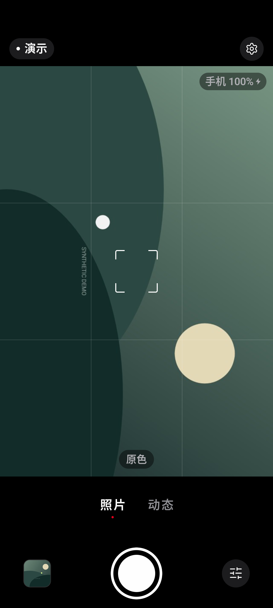
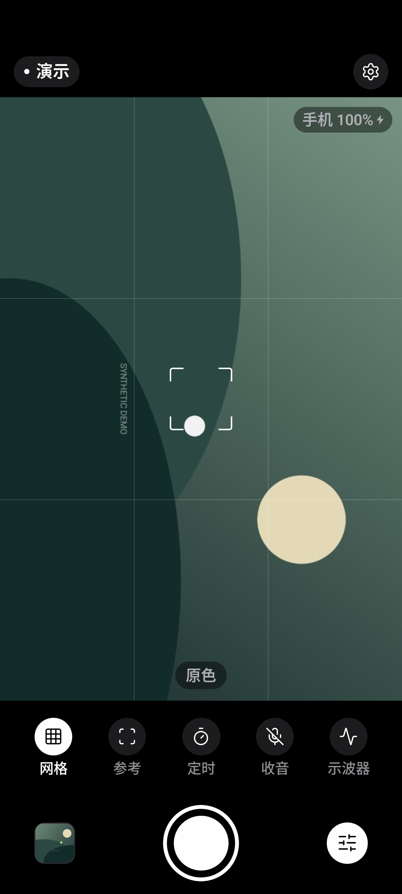

# 瞬间 Lumix / Moment

为 Panasonic LUMIX 系列相机打造的 React Native 动态照片应用。USB-C 数据线直连或实验 Wi-Fi，不需要视频采集卡、不依赖云端、不刷机。界面按通用 LUMIX 设计；S5 的 Wi-Fi 型号问题由用户实测发现，修复后尚待实测，其他机型尚未逐一验证。

Experimental Android companion for Panasonic LUMIX dynamic photos over USB or experimental Wi-Fi. Unofficial, MIT-licensed. **Not yet verified on any physical camera.**

[预发布说明 v0.8.0-beta.7](.github/releases/v0.8.0-beta.7.md) · [最新稳定版 v0.7.0](https://github.com/USER-HFC/moment-s5/releases/tag/v0.7.0) · [MIT 许可证](LICENSE) · [测试范围](TEST_REPORT.md)

**v0.8.0-beta.7（code 28）是预发布版。v0.7.0 仍是最新稳定版。** 日常使用请安装 [v0.7.0](https://github.com/USER-HFC/moment-s5/releases/tag/v0.7.0)。本版在 beta.6 的基础上整套改版：黑白灰加一点徕卡红，拍摄页改为左上连接、右上设置、快门右侧的拍摄控制抽屉；相册、设置、各个面板和 App 图标一起换新。照片同步也做了提速：USB 大文件每次直接读 1 MB，LUT 改为查表并行处理，连接诊断里记录每张照片的分段耗时。安装包文件名和校验见 [v0.8.0-beta.7 发布说明](.github/releases/v0.8.0-beta.7.md)。

本版继续提供两种拍摄：普通照片下载这一次的 JPEG，动态照片在约 3 秒取景缓存就绪后保存。USB 是默认和推荐的连接方式；Wi-Fi 仍是实验功能，界面标明「未经真机验证」。LUT、透明示波器、相册和设置都可从拍摄页直接进入。第一次打开会先看到三张引导。

USB 与实验 Wi-Fi 的协议修复概括如下，完整清单在 [PROTOCOL_FIXES.md](PROTOCOL_FIXES.md)：

- USB 和 Wi-Fi 都不再限定初代 S5：USB 接受提供松下 PTP 联机的 LUMIX，Wi-Fi 接受 description 厂商为 Panasonic 的 LUMIX。机型范围扩大不等于已经验证，都还没有真机证据。
- USB 在收到回复的第一个字节之前会一直等到期限，快门期限为 60 秒；传输中途超时仍然断开。ISO 和光圈优先读当前参数，快门可以显示 B 门、整秒和分数快门。
- 曝光读数不再停在连接瞬间：USB 空闲时约 2 秒刷新一次，机身的 `0xC102` / `0x4006` 属性变化会提前触发；Wi-Fi 的 `getsetting` 也改为约 2 秒且只在机身空闲时读取。超过 6 秒没有新样本，HUD 会标为「上次读数已过期」。
- 实验 Wi-Fi 按公开的 LUMIX Sync 顺序等待机身确认、订阅事件后再取景，兼容普通握手和加密握手（加密机型未验证），并以较疏的保活和有限的目录读取减少整卡遍历。原片允许 512 字节填充。快门仍然只发一次。
- 机身自己按快门保存的 JPEG 会在 USB 连接时同步进 App 相册：按 Lumix 文件名序号配对，双卡备份只导入一次，已经同步过的文件不会重复导入。

**尚未在真实相机上验证。** 没有实体相机，协议修复只用自写的假设备测过，界面只在模拟器演示里跑过。本版截图在 `evidence/v0.8.0-beta.7` 目录，同步提速只在假 USB 设备和主机检查上验证过。从 v0.7.0 升级须先把照片导出到系统相册并确认，再卸载 v0.7.0，因为签名不同；已安装的 beta.4、beta.5 或 beta.6 可以直接覆盖安装为本版，不必卸载。

 

## 当前交付

- React Native Android APK，最低 Android 13（API 33），只提供 `arm64-v8a`。支持竖屏和双向横屏，顶栏、取景、拍摄控制和快门区随方向重排。`mobile/` 是 RN 工程，产品名为「瞬间 Lumix」。启动后直接进入拍摄页。
- 连接面板默认是 USB。同一面板提供「Wi-Fi（实验）」和演示。连接面板从左上角的连接胶囊打开；连上之后胶囊写机型和方式，例如「DC-S5 · USB」，演示时写「演示」。右上角是设置。图片水印仍是 MOMENT / SYNTHETIC DEMO。
- **照片**：下载本次 JPEG，可选 LUT，写入 App 相册，并可导出到 `DCIM/MomentS5`。无三秒预缓存，不生成视频。机身 SD 卡原片保持不动。
- **动态**：手机保留快门前约 3 秒取景。画面显示「已缓存 3 秒 · 可拍」后，快门冻结这段队列并触发机身拍摄，再接收本次 JPEG，打包为动态照片。视频里只有快门前的取景帧。「可拍」只出现一次。
- **LUT 面板**：取景下方的 LUT 胶囊显示当前风格，点开后面板浮在取景内，列出内置 Fuji 风格预设、导入的 `.cube` / `.zip` 和「原色」。切换时立即作用于实时取景、快门前缓存和之后的 `rendered.jpg`；拍摄处理中会暂时禁用。导入和刷新也在同一面板里。
- **机身照片同步**：USB 连接时，用机身快门拍的照片会作为新文件被同步进 App 相册，标记「机身快门同步」。配对按 Lumix 文件名序号和大小去重，双卡备份不会导入两份；不会把上一次的照片当成这一次。
- 监看有实时取景和构图网格。LUT 同时作用于监看和手机端渲染；`original.jpg` 永远是相机原始 JPEG，`rendered.jpg` 才是派生文件。可导入 LUMIX Lab 的 33-grid `.cube` 或包含它的 `.zip`。内置 8 个只读 Fuji 风格近似预设，说明见 [NOTICE.md](NOTICE.md)。LUT 必须和输入色彩空间匹配，App 不会把普通 JPEG 自动变成 V-Log。
- **透明示波器**：可同时打开 RGB 直方图、亮度波形、RGB 分列和矢量示波器。图表可以拖到整个取景区的任意位置，包括曝光 HUD 上方；没有卡片背景或标题栏，所以必要时会盖住 HUD 文字。操作图标 5 秒无操作后自动隐藏，长按图表 3 秒再显示；支持移动、放大 / 缩小和关闭，位置和尺寸在本次会话内保留。
- **对焦面板**：取景中央的对焦框点按即自动对焦（Wi-Fi 要机身声明支持）。USB 连接时拍摄控制里另有「对焦」，展开近 / 远两档的相对步进面板；每按一下走一档，方向尚未在真机上确认，也没有精确 A/B 拉焦。
- **相册**：从拍摄页进入，按「今天 / 昨天 / 日期」分组。底部的浮动胶囊可筛选全部、照片、动态、机身同步。点右上角「选择」或长按进入多选，可以一次导出或删除；删除前会确认，只删 App 内副本。查看器使用贴边渐变栏，单击切换沉浸模式，双指缩放、双击放大，下滑关闭。动态照片标 LIVE，可长按或点 LIVE 回放。分享是应用内的底部面板，列出动态照片、动态视频、原片和当前画面；没有对应文件的选项不出现。信息面板从底部升起，显示机型、镜头、ISO、快门、光圈、焦距、文件大小、来源、连接、LUT 和导出状态。更换 LUT 使用横向胶片条，缩略图在后台生成，选中实时预览，按住照片可对比原片。
- **设置**：拍摄页的「设置」分成拍摄偏好、存储、使用指南、连接诊断和关于。偏好可以打开拍摄后自动导出、机身快门照片自动同步、记住上次的照片或动态、网格、参考框和定时，以及音量键拍照、反转近 / 远对焦方向和快门震动。设置列表里直接显示存储占用和当前版本。存储页显示照片数量和占用；已经导出的 App 内副本可以清理。没有可清理的照片时，清理按钮不可点，下面写「没有可清理的照片」；有可清理的照片时写「可清理 N 张，约 X MB」。机身 SD 卡不受影响。使用指南写 USB 和 Wi-Fi 的步骤、常见问题，也可以再看一遍首次引导，并提供反馈入口。连接诊断可以查看、复制和分享，顶部附 App 版本、构建号、Android 版本、手机型号和连接方式；时间是钟点，记录里不包含机身序列号，日志不上传。关于显示版本 `0.8.0-beta.7（28）`、许可、项目主页、第三方声明，以及版本名、版本号、构建时间、提交、构建类型、ABI 和最低 Android 版本，可一键复制打包信息。
- **拍摄页细节**：切到相册或设置再回来，照片 / 动态、定时、参考框、网格都保持原样。返回键先关打开的面板；已连接或演示中按返回会提示「再按一次退出，相机会断开」。设置里打开「音量键拍照」后，在拍摄页按音量键等于按快门（定时开着时走倒计时）。构图参考是和定时一样的面板（关、3:2、16:9、1:1、4:5），框外压暗，网格画在框内；倒计时是大号数字加进度环。保存后提示写明类型和 LUT，例如「动态照片已保存 · Classic Chrome」。
- **提醒**：相机意外断开时出现「相机已断开 · 重新连接」，按上次的方式重连；App 在前台时插上 USB 相机会提示「检测到相机 · 连接」，点了才连。手机可用空间低于 300 MB 时快门会说明原因并带「去清理」。相机电量 ≤ 15% 时 HUD 变红并提醒一次（目前 USB / Wi-Fi 还没有可靠的机身电量读数）。连接面板记住上次成功的方式和 Wi-Fi IP。
- **相册安全感**：删除用深色确认框，删除后 5 秒内可以撤销；多选可以一起分享；已导出的照片带角标。
- **首次引导**：第一次打开显示三张卡片，分别是连接相机、拍动态照片、套用 LUT，每张有对应图标。可以跳过，只出现一次。
- 可选手机麦克风，默认关闭。按钮标明「收音 关」或「收音 开」，授权后才把声音并入动态照片。

**状态：当前 release 能在 Android 模拟器里启动并完成上述演示界面和本地相册流程。尚未在真实相机上验证 USB 会话、Wi-Fi 握手、镜头步进方向、机身照片同步、曝光刷新、取景连续性或 ColorOS 相册识别。** iOS 页面工程已由 RN 生成，ImageCaptureCore / PTP 原生桥还没接入，不能把 iPhone / iPad 当成已支持。动态照片也不能直接当作 Apple Live Photo。

交互取舍见 [DESIGN.md](DESIGN.md)，更早的测试范围见 [TEST_REPORT.md](TEST_REPORT.md)。

## 在手机上使用

1. 稳定使用请下载 [v0.7.0](https://github.com/USER-HFC/moment-s5/releases/tag/v0.7.0)。试用本版请按 [v0.8.0-beta.7 发布说明](.github/releases/v0.8.0-beta.7.md) 安装 arm64 APK。从 v0.7.0 升级时，先把照片保存到系统相册并打开确认，再卸载 v0.7.0。已安装 beta.4、beta.5 或 beta.6 的可以直接覆盖，不必卸载。卸载会清掉 App 内照片和导入的 LUT，SD 卡原片和已经导出的副本还在。
2. 手机设置里打开 OTG。用能传数据的 USB-C 线连接 LUMIX 相机。这是推荐方式。
3. 相机选择 **PC(Tether)**、单张、JPEG 或 RAW+JPEG，并确认 SD 卡可写。先用较短快门，例如 1/125s。不同机型的菜单名称可能不同，本版只按通用松下 PTP 规则处理。
4. 打开 App 即进入拍摄页。点左上角的连接胶囊，默认用 USB 并允许访问。同一面板里的「Wi-Fi」（标有「实验」）需要相机自己的 Wi-Fi，并在界面上标明尚未真机验证；没有相机时用「体验演示」。
5. 点快门右边的按钮展开拍摄控制：网格、参考、定时、收音和示波器；点其中一项，选项在原位展开。LUT 从取景下方的胶囊打开，设置在右上角。有取景时点中央对焦框做自动对焦。USB 连接后拍摄控制里才会出现「对焦」，展开近 / 远面板；每按一次走一档，方向还要用真机看镜头实际往哪边动。
6. 底部默认是 **照片**，点快门即拍并下载这一张 JPEG。选了 LUT 时，快门瞬间的 LUT 会被冻结，原片仍保留。改选 **动态** 后，等到「已缓存 3 秒 · 可拍」再点「拍摄动态照片」。快门暂时不能按时，点一下会说明原因。接收这张照片时，不要同时按机身快门或打开另一套遥控软件。
7. 「相册」按日期打开网格，底部的浮动胶囊可以筛选全部、照片、动态或机身同步。长按可以多选后批量导出或删除。点照片进入查看器：单击显隐操作，双指缩放，双击放大，下滑关闭；动态照片长按或点 LIVE 回放。分享从底部面板选择动态照片、视频、原片或当前画面。信息面板可看拍摄参数和导出状态；「LUT」打开胶片条重新套用；「导出」写入 `DCIM/MomentS5`。删除只删 App 内副本。
8. 需要声音时点「收音」并允许麦克风。按钮会显示「收音 开」或「收音 关」。离开 App 后收音和连接都会停，回来要手动重连。
9. 「设置」里可以改拍摄偏好、查看存储、打开使用指南或连接诊断；「关于」可以核对版本和构建信息。反馈问题时请附上连接诊断。

**定时**：点「定时」在面板里选关、2、5、10 或 30 秒，再按快门开始倒计时；倒计时中再按一次快门（或音量键）取消。离开页面、退到后台或断开连接会取消还没到点的任务。这里没有后台定时、间隔连拍或失败自动重拍。定时照片同样下载本次 JPEG。相册只看手机里的 App 副本，不浏览相机存储卡。

没有相机时点「体验演示」。照片模式会走 JPEG 保存、LUT 和导出；动态模式另外走缓存和编码。画面上的 MOMENT / SYNTHETIC DEMO 水印表示这是演示素材。

## 重要的能力边界

- **照片**是相机这一次的 JPEG。RAW 留在机身，本版不下载、不处理 RW2，也不会主动删除相机里的文件。
- **机身照片同步**只处理 USB 会话期间新出现的 JPEG。相机在 App 未连接、没有建立基线时拍的照片不会被追溯导入；RAW 不会同步。
- **动态**来自取景流，最长边 960 像素、输出 15 fps。重复帧按真实时间间隔显示。它是快门前的监看，不是机内 4K，也不是事后补出来的 RAW。
- 动态视频停在发出快门指令之前的缓存。动态照片里，静态照片的时间标记落在视频最后一个编码帧。照片和动态的对齐还要在真机上校准。
- 只有动态模式要求预缓存满 3 秒，并且帧间隔不超过 500 ms。间隔更大时快门会停用。App 不用快门之后的画面补这段视频。
- 声音来自手机麦克风。缓存不够或没有录音权限时，动态照片可以是无声的。
- 首次真机测试建议先用横构图。竖拍静态 JPEG 的 EXIF 会原样保留；机身取景方向和动态画面是否一致，还没在真机上看过。
- 系统相册会不会把文件认成动态照片，取决于 ColorOS 版本。App 内长按回放不依赖这个识别。
- 退到后台会断开连接，没有后台连续预录。同一时间只有一个拍摄任务。原片接收上限 64 MB，压缩 JPEG 环形缓存上限 32 MB。
- 对焦没有独立的自动对焦按钮，也没有精确的 A/B 拉焦。中央对焦框是点按自动对焦；近 / 远是对焦面板里的 USB 相对步进，方向尚未在真机上确认。Wi-Fi 侧不提供近 / 远按钮。
- 实验 Wi-Fi 仍可能在真实机身上失败。已知还要真机数据才能决定的事项写在 [PROTOCOL_FIXES.md](PROTOCOL_FIXES.md)，包括快门前是否必须进出一次播放模式，以及手动对焦档位的方向。USB 仍是默认和推荐方式。
- 示波器分析的是 LUT 之后的监看 JPEG，是构图和曝光的参考，不是 RAW 或机内测光。图表可以覆盖整个取景区，可能挡住 HUD 文字。
- 通用 LUMIX 支持只表示不再按 S5 型号拒绝连接；还没有任何机型的真机验证。

## 构建

环境：Node 18+、JDK 17、Android SDK Platform 35、Gradle 8.10.2。Paper、safe-area-context 和 document-picker 依赖由 `mobile/package-lock.json` 锁定。

安装 JDK 17 并配置 Android SDK（Android Studio 可代为安装），设置 `ANDROID_HOME` 或在不提交的 `local.properties` 中配置 `sdk.dir`。Windows 可执行：

```powershell
cd mobile; npm ci; cd android
.\gradlew.bat :app:assembleRelease :app:assembleAndroidTest
cd ..; npm test -- --runInBand
```

新机器可运行 `tools/bootstrap.ps1` 下载所需 Android 命令行工具。脚本只使用自己的工具目录，不改系统 PATH 或 JAVA_HOME；JDK 17 需已安装。完成后按输出指令接受 Android SDK 许可并构建。

### 设备媒体检查

```powershell
.\gradlew.bat :app:assembleDebug :app:assembleDebugAndroidTest
adb -s emulator-5554 install -r app/build/outputs/apk/debug/app-debug.apk
adb -s emulator-5554 install -r app/build/outputs/apk/androidTest/debug/app-debug-androidTest.apk
adb -s emulator-5554 shell am instrument -w cn.moment.lumix.test/cn.moment.lumix.DeviceChecks
adb -s emulator-5554 shell am instrument -w -e suite layout cn.moment.lumix.test/cn.moment.lumix.DeviceChecks
```

检查会创建明确标记的演示照片并导出一份到模拟器相册，覆盖 2.2 秒准备卡顿后的自动补帧、仅快门前 3 秒且不进行快门后取景、末帧时间标记、完整 CaptureEngine、原片尺寸、AVC 样本时间、视频解码、XMP 视频长度、AAC 合并与相册字节一致性。它不测试真实 USB。

`suite layout` 验证四入口、横屏监看、定时单拍及手动/导航/后台取消。`tools/ui-smoke.ps1` 只允许模拟器，执行连接错误提示、演示快门、相册回放、定时取消及小屏大字体截图；会在结束时恢复模拟器显示设置。可用 `-EvidenceDir` 单独保存各版本证据。

## 代码定位

| 文件 | 职责 |
| --- | --- |
| `UsbS5.java` / `Ptp.java` | USB 端点、PTP 容器、LUMIX 指令、拍摄事件、原片接收 |
| `WifiS5Protocol.java` / `WifiS5Transport.java` | 实验 Wi-Fi 的 `cam.cgi`、UPnP 事件、保活、曝光读取和 UDP 取景 |
| `CaptureEngine.java` / `FrameRing.java` | 单任务拍摄、快门前缓存、机身照片同步、曝光刷新、错误保留、帧间隔测量 |
| `VideoEncoder.java` | JPEG 时间序列转 H.264，实际时间上的缺帧保持 |
| `AudioRing.java` / `AudioMux.java` | 可选 PCM 缓存、AAC 编码与复用 |
| `MotionPhoto.java` / `MomentStore.java` | 标准格式、本地存储、MediaStore 导出 |
| `MomentRender.java` / `MomentDetails.java` | 从原片重新套 LUT、动态照片重新封装、信息与分享文件 |
| `mobile/App.tsx` / `mobile/src/native.ts` | React Native Paper 界面、页面切换和跨平台数据契约 |
| `mobile/src/ui/` | NativeWind（Tailwind）设计组件：文字、按钮、分段按钮、分组列表、开关和 lucide 图标 |
| `mobile/src/CameraWorkspace.tsx` / `CaptureDrawer.tsx` / `LutFlyout.tsx` | 拍摄页、拍摄控制抽屉（含定时、参考、示波器、对焦选项）、LUT 面板 |
| `mobile/src/MotionAlbum.tsx` | 相册网格、沉浸查看器、信息面板和 LUT 胶片条 |
| `mobile/src/SettingsScreen.tsx` / `StorageScreen.tsx` / `GuideScreen.tsx` / `DiagnosticsScreen.tsx` / `AboutScreen.tsx` / `OnboardingCards.tsx` | 设置、存储、使用指南、连接诊断、关于和首次引导 |
| `mobile/src/scopes/` | 示波器分析订阅、图表和面板状态 |
| `mobile/android/.../MomentS5Module.java` | RN Android 原生桥、LUT 仓库、相册 URI 和打包信息 |
| `MainActivity.java` / `PreviewView.java` / `HoldPhotoView.java` | 旧版 Android 界面，仅作迁移参考 |
| `ShareProvider.java` | 限定输出路径的只读分享 |

每次成功拍摄动态照片包含 `original.jpg`、`motion.mp4`、`MOMENT_MP.jpg`、`moment.json`；启用 LUT 时另有 `rendered.jpg`。静态原片与视频可独立分享，也保留后续转换到 Apple Live Photo 的素材基础；本版未提供该转换器。普通照片（含定时和机身快门同步）只保存 `original.jpg`、`moment.json`，选 LUT 时另有 `rendered.jpg`，不创建 MP4 或动态照片文件。

## 开源来源

项目代码使用 [MIT 许可证](LICENSE)。第三方组件保留各自许可证；Gradle Wrapper 使用 Apache-2.0，见 [NOTICE.md](NOTICE.md)。本项目与 Panasonic 没有官方关联。

相机协议适配自 MIT 许可的 [baku89/tethr](https://github.com/baku89/tethr)，固定参考提交和完整许可见 [NOTICE.md](NOTICE.md)。没有打包松下固件或闭源 SDK DLL。

动态照片文件使用 Android Motion Photo 格式，说明见 [Android 官方文档](https://developer.android.com/media/platform/motion-photo-format)。USB 访问使用 [Android UsbManager](https://developer.android.com/develop/connectivity/usb/host)。

## 内置 Fuji 风格 LUT

拍摄页的 LUT 面板提供 8 个 MIT 许可的内置预设：Provia / Standard、Velvia、Astia、Classic Chrome、Classic Negative、Eterna、Acros、Pro Neg.Std。列表以「内置」标注只读预设，随 APK 提供，不占用导入文件目录，也没有删除操作；自定义 `.cube` / `.zip` 仍通过「导入」加入本地仓库。「原色」关闭 LUT，内置与导入预设均作用于监看、快门前缓存和 `rendered.jpg`，相机原始 `original.jpg` 保留原样。相册里的「LUT」会从原片重新生成派生文件；动态照片会用新的静态图和原视频重新封装 `MOMENT_MP.jpg`。

这些是原创的非官方近似效果，适用于普通 SDR sRGB / Rec.709 JPEG，建议使用机身标准照片风格。源码、每个预设的 SHA-256、来源核查和 MIT 许可见 [NOTICE.md](NOTICE.md)、`third_party/fuji-style-SOURCES.txt` 与 APK 资产中的 `luts/manifest.json`。可运行 `python3 tools/generate_fuji_style_luts.py --check` 检查生成结果，`python3 tools/check_bundled_luts.py --java-home /path/to/JDK17` 验证所有预设、实际资产加载、图像处理和 LUT 后示波器数据。

## 实时示波器

拍摄控制里的「示波器」可同时打开 RGB + 亮度直方图、亮度波形、RGB 分列和矢量示波器。图表透明叠在取景上，不带窗口底色、卡片边框、标题栏或页脚。每张图表的移动、放大 / 缩小、关闭图标均提供至少 48dp 触摸区和中文无障碍名称；可独立多开、调整大小和移动，位置可以覆盖整个取景区，包括曝光 HUD 所在的区域。会话保留各图表位置和尺寸，横竖屏切换不互相关闭或重置。演示模式同样提供实时数据，取景中断保留「取景暂停」提示。

没有操作 5 秒后，图表上的移动 / 缩放 / 关闭图标自动隐藏，只留下一张透明图表；长按图表 3 秒会重新显示图标并触发一次短震。图表可以拖动，放大 / 缩小在 S 与 M 两档之间切换。无障碍操作也可以直接移动、缩放、关闭或显示图表操作。密度行、刻度和通道标签按尺寸调整，亮色画面上仍保留描边。

Android 在独立低优先级线程中分析与监看相同的 LUT 后 JPEG（内置或导入 LUT 均适用），最长边降采样至 256 像素，匹配当前 3:2 / 16:9 裁切及竖屏旋转，目标约 10 Hz；仅保留一个正在分析的帧。关闭所有面板、离开拍摄页或进入后台即停止分析，返回拍摄页可恢复本次会话。亮度与色差按全范围 JPEG 的 Rec.709 Y′ / Cb / Cr 计算，矢量图显示 75% 色标；这些是监看诊断，不是 RAW、机内曝光值或自动 V-Log 转换。没有新增 npm 依赖。

`cameraScopes` v1 事件提供四组 Base64 Uint8 数据：RGBY 直方图 4 × 256、波形 64 × 64、RGB 分列 3 × 32 × 64、矢量图 64 × 64。纯 Java 数学与采样节奏检查可用 JDK 17 运行 `sh tools/check-scopes.sh`；JS 解码、多个面板状态和订阅生命周期检查包含在 `cd mobile && npx tsc --noEmit && npx jest` 中。真实相机 / 手机连续采样性能仍需实体设备验证。

### Wi-Fi 实验（v0.8.0-beta.1 起）

**实验性 · 未经真机验证。推荐使用 USB。** 连接面板默认 USB；切到「Wi-Fi（实验）」后，可输入相机 SSID / 密码由 Android 请求加入，或先在系统设置连接相机 Wi-Fi，再选择「已手动连接相机 Wi-Fi」并填相机 IP。默认 `192.168.54.1` 只是常见候选地址，以机身实际地址为准。IP 输入框支持完整 IPv4，本版已在模拟器上重新输入 `192.168.54.1` 验证；仍未用真实相机连接。SSID / 密码只用于本次系统请求，不写入日志或照片。

本版使用独立的 `CameraTransport`：USB 包装原有 `UsbS5`，实验 Wi-Fi 使用串行 `cam.cgi`、`getstate` 保活、独立 UDP 完整 JPEG 接收和 description 公布的 DLNA ContentDirectory。相机 HTTP / UDP socket 绑定到所选 Android `Network`，不绑定整个进程或替换默认互联网网络。应用的通用明文 HTTP 策略保持关闭；相机专用 socket 客户端另行强制同一相机私有 IPv4、校验公布的资源地址、拒绝重定向和控制指令资源。debug 的 Metro 例外仅限 localhost / 模拟器主机。

- 以 description 的 `manufacturer=Panasonic` 识别 LUMIX，型号取 `modelNumber`；不再要求 `modelName=DC-S5`。
- 配对使用 `req_acc` 协议：机身弹出确认时会继续等待用户确认，而不是立刻判失败；description 声明支持加密握手（`X_CamCapability` 以 1 结尾）时走 `req_acc_g` / `req_acc_e`，机身拒绝时回退普通握手。加密路径来自对 LUMIX Sync 的公开分析，未在加密机型上验证。
- Wi-Fi 的自动对焦候选是 `oneshot_af`，手动对焦候选是 `wide-slow` / `tele-slow`。界面不提供 Wi-Fi 的近 / 远按钮。USB 连接时才会出现「对焦」面板；点按取景中央对焦框做自动对焦。曝光只展示读到的字段，并约每 2 秒在机身空闲时刷新。
- 拍摄前的目录基线只读根目录和最新文件夹；之后只再列新增或 `childCount` 有变化的文件夹，避免把整张卡扫一遍。快门只发一次，超时或拒绝后退出会话，**绝不自动重发**。只接受唯一新对象中的 `CAM_ORG` / `CAM_RAW_JPG` 原 JPEG。请使用单张 JPEG / RAW+JPEG，避免机身或其他 App 同时拍摄。
- 原片允许 EOI 之后的填充。校验 SOI / SOF / SOS / EOI 后原子发布，再按模式保存：普通照片走 LUT / JPEG / 相册 / 导出；动态照片再用三秒快门前的画面封装。满 3 秒且帧间隔不超过 500 ms 的门槛只约束动态模式。
- 取景按每个 UDP 数据报里的 S5 头部偏移找 JPEG，失败时再在报头附近搜索标记，并截到 EOI。残帧丢弃，队列最多三帧。跨数据报的未知分包仍要真机抓包确认。离开前台会释放取景和网络。暂不包含 BLE 唤醒、自动发现或 iOS Wi-Fi。

模拟器闭环只证明本项目自写 mock 与 App 的协议 / 媒体路径，不能代替真实相机、手机、双 STA / 蜂窝共存、长曝光、双卡或原片 SD 字节一致性验收。证据见 [Wi-Fi beta 验证报告](evidence/v0.8.0-beta.1-wifi/REPORT.md)，实体测试清单见 [无线研究](docs/research/wireless-connection.md)。纯 Java 主机检查运行 `JAVA_HOME=/path/to/JDK17 bash tools/check-wifi.sh`；保留现有 core / native / scopes / LUT / Jest 与 `python3 -I -m unittest discover tools/s5-wifi` 检查。

debug APK 才显示「模拟相机调试」，release 会在原生层拒绝任意主机设置。release 的自测适配器是 `python3 -I tools/s5-wifi/mock_release_camera.py`，命令和临时端口转发写在 [tools/s5-wifi/README.md](tools/s5-wifi/README.md)。mock 仍然只证明自写夹具，不能代替真实相机。

**升级签名：beta 系列与 v0.7.0 的签名不同。** 从 v0.7.0 升级须先把照片导出到系统相册并确认，再卸载 v0.7.0。卸载会删除 App 内照片和导入 LUT，SD 卡原片及已导出副本保留。`0.8.0-beta.7` / code `28` 是本仓库的预发布，v0.7.0 仍为最新稳定版。beta.4、beta.5、beta.6 与本版签名证书相同，可以直接覆盖安装。
